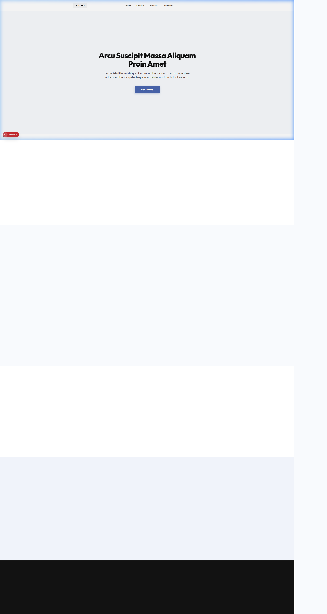
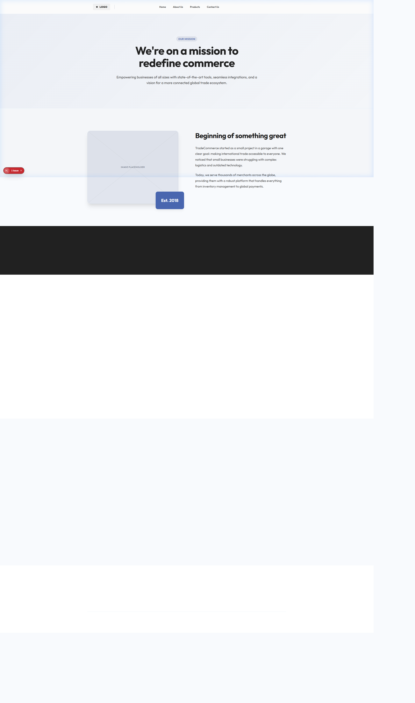
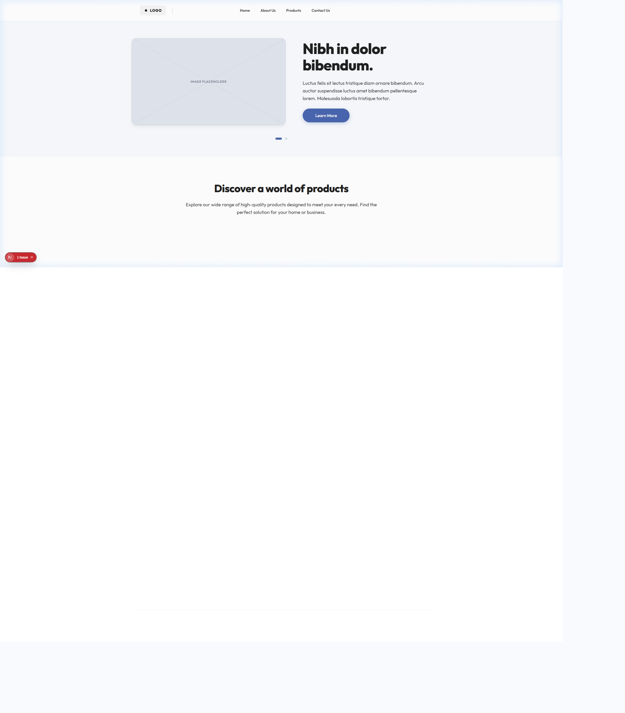
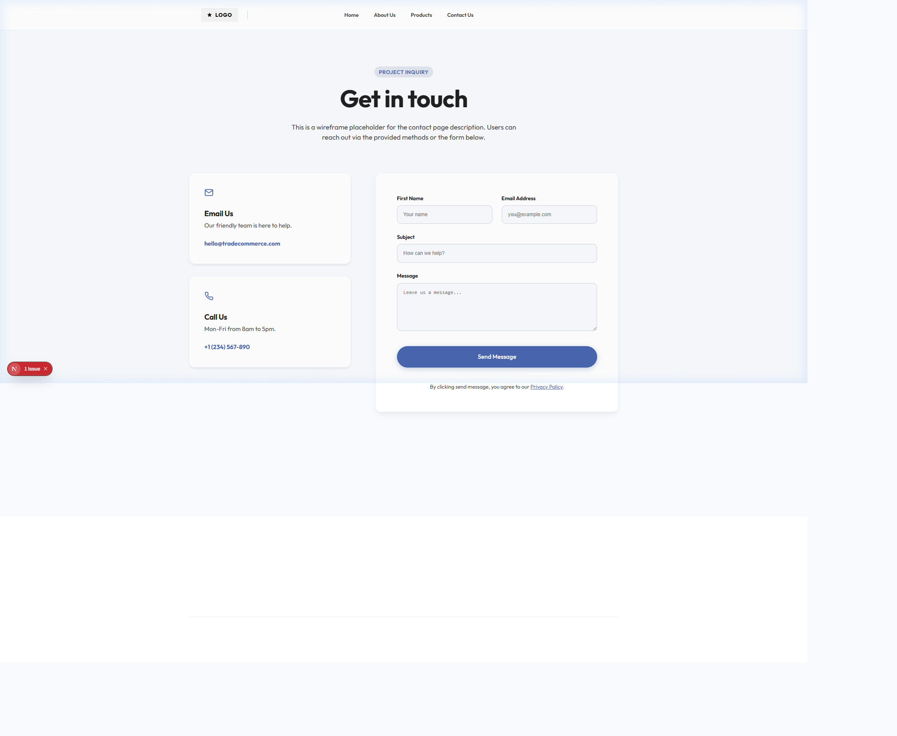

# Trade Network Limited - Lo-Fi Mockup

This project is a high-fidelity representation of a **Lo-Fi Wireframe Mockup** for Trade Network Limited. Designed to focus purely on layout, user flow, and structure, this prototype acts as a functional shell for a standard e-commerce/corporate website.

## 🚀 Overview

The concept behind this project is to build out a full Next.js application that looks and functions exactly like a wireframe tool (e.g., Balsamiq or Whimsical). It utilizes:

- Grayscale/minimalist color palettes
- Consistent "Image Placeholder" components complete with watermarks
- Lorem Ipsum typography specifically designed to not distract the viewer
- Smooth scroll-reveal animations to give life to the wireframe

## 📸 Page Layouts

### Home Page

A sweeping hero section with an abstract vector pattern, leading into a slider of featured products, a testimonials carousel, and a clean logo/gallery band.


### About Us

Streamlined company story layout and core values presentation, stripped of real copy to focus purely on structural presentation.


### Discover (Products)

A vertical showcase of product cards demonstrating how alternating grid layouts function in the design system.


### Contact

A functional contact shell demonstrating a dual-column information and form layout.


## 🛠 Tech Stack

- **Framework**: Next.js 14 (App Router)
- **Styling**: Vanilla CSS (CSS Modules & Global Styles)
- **Icons**: Lucide React
- **Animations**: Custom IntersectionObserver-based hooks for standard page reveals

## 🏃‍♂️ Getting Started

First, run the development server:

```bash
npm run dev
# or
yarn dev
```

Open [http://localhost:3000](http://localhost:3000) with your browser to see the result.

## 🏗 Production Build

To build the project for production, run:

```bash
npm run build
npm start
```
